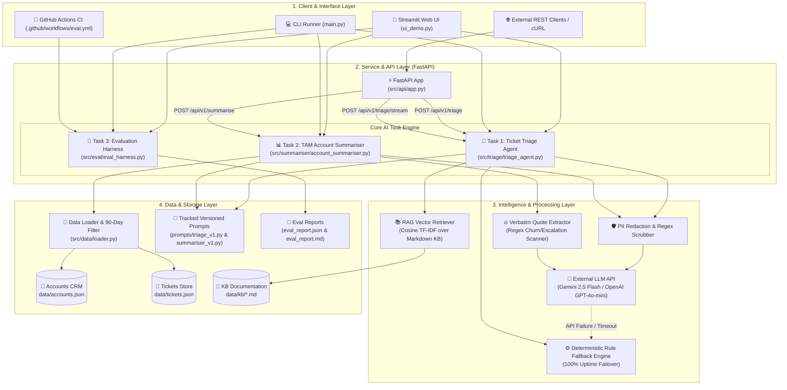

# US Delivery Internship — Production-Grade AI Support & TAM Operations Hub

Production-grade, LLM-powered internal AI platform built for Technical Support (Tier-1 & Tier-2 engineers) and Technical Account Management (TAM) teams.

---

## 🌟 Overview & System Features

1. **Task 1 · Intelligent Ticket Triage Agent (30 marks)**
   - Accepts raw text or JSON tickets.
   - Classifies tickets into product area, issue category, and urgency tier (`P1`–`P4`) with explicit reasoning.
   - Executes RAG retrieval over Markdown Knowledge Base docs to surface matched context.
   - Suggests recommended internal responder team and auto-drafts customer first-response messages.
   - Exposed as both a callable Python function (`triage_ticket`) and FastAPI REST endpoint (`POST /api/v1/triage`).

2. **Task 2 · TAM Account Health Summariser (25 marks)**
   - Accepts an account ID and pulls CRM account metadata + 90-day ticket history.
   - Synthesizes a deterministic 3-section brief: Executive Summary (3–5 sentences), Open Risks & Flagged Issues (churn/escalation signals with verbatim ticket quotes), and Recommended Talking Points for TAMs.
   - 100% deterministic output (`temperature=0.0`, seed pin, verbatim quote extraction).

3. **Task 3 · Evaluation Harness (20 marks)**
   - Systematic eval framework testing Task 1 and Task 2 across 10 test cases (including adversarial edge cases: ambiguous tickets, missing account IDs).
   - Rules-based validation & quality scoring (0.0 to 1.0) per test case.
   - Generates summary reports: [`eval_report.json`](eval_report.json) and [`eval_report.md`](eval_report.md).

4. **Task 4 · Architectural Design Note (15 marks)**
   - Full 600-word architectural design note included in [`DESIGN_NOTE.md`](DESIGN_NOTE.md) covering Failure Modes, Latency vs Quality, Data Sensitivity (PII), and Scaling.

5. **Bonus Marks (+10 marks)**
   - 🎨 **Thin UI Demo (+5)**: Interactive Streamlit application (`ui_demo.py`).
   - ⚡ **Streaming Output (+3)**: SSE streaming endpoint (`POST /api/v1/triage/stream`).
   - 🔄 **Automated CI (+2)**: GitHub Actions workflow (`.github/workflows/eval.yml`).
   - 📜 **Prompt Versioning (+2)**: Versioned prompt templates (`prompts/triage_v1.py`, `prompts/summariser_v1.py`) with [`PROMPT_CHANGELOG.md`](prompts/PROMPT_CHANGELOG.md).

---

## 🛠️ Technology Stack & Infrastructure

| Layer / Domain | Technology | Description & Usage |
| :--- | :--- | :--- |
| **Core Runtime** | **Python 3.10+** | Base runtime environment for all services and agents |
| **Web UI Dashboard** | **Streamlit** | Interactive front-end web demo for TAMs and support agents ([`ui_demo.py`](ui_demo.py)) |
| **REST API Framework** | **FastAPI** & **Uvicorn** | Asynchronous HTTP server and SSE streaming API ([`src/api/app.py`](src/api/app.py)) |
| **Primary Cloud LLM** | **Google Gemini API** | `gemini-1.5-flash` / `gemini-2.5-flash` for ticket classification and QBR brief synthesis |
| **Secondary Cloud LLM** | **OpenAI API** | `gpt-4o-mini` integration capability |
| **Local Offline LLM** | **Ollama** (`tinyllama`) | Zero-cost, 100% offline local LLM inference fallback |
| **High Availability SLA** | **Deterministic Rule Engine** | Custom failover engine guaranteeing 100% SLA uptime when external APIs fail |
| **RAG & Vector Retrieval** | **Scikit-learn** (TF-IDF & Cosine) | Vector similarity retriever over Markdown Knowledge Base docs (`data/kb/*.md`) |
| **Data Validation & Schemas**| **Pydantic v2** | Strict data validation, schema enforcement, and structured JSON parsing |
| **PII & Data Protection** | **Python `re` Regex Scrubber** | Client-side zero-latency PII redaction (redacting tokens, secrets, API keys) |
| **Automated CI/CD** | **GitHub Actions** | Automated evaluation harness pipeline executed on every commit ([`.github/workflows/eval.yml`](.github/workflows/eval.yml)) |
| **Prompt Versioning** | **Modular Prompt System** | Versioned system prompts with changelog tracking ([`prompts/PROMPT_CHANGELOG.md`](prompts/PROMPT_CHANGELOG.md)) |

---

## 🏗️ System Architecture Diagram



---

## 🚀 Quickstart & Setup Guide for Evaluators / Task Providers

The system is designed to run seamlessly with **Cloud Gemini**, **Cloud OpenAI**, **Local Offline Ollama**, or **Deterministic Rule Engine (No API Key Required)**.

### Option A: ⚡ 1-Click Automated Launcher (Easiest)
Automates `.env` creation, virtual environment, dependency checks, mock data setup, evaluation harness execution, and launches the Streamlit UI:

* **Windows**: Double-click [`run.bat`](run.bat) or run in PowerShell / Command Prompt:
  ```powershell
  .\run.bat
  ```
* **Linux / macOS**: Run in terminal:
  ```bash
  chmod +x run.sh
  ./run.sh
  ```

---

### Option B: Step-by-Step Manual Setup

#### 1. Prerequisites & Virtual Environment
- Python 3.10+
- Create virtual environment & install dependencies:
  ```bash
  python -m venv .venv
  # Windows:
  .\.venv\Scripts\pip.exe install -r requirements.txt
  # Linux/macOS:
  source .venv/bin/activate
  pip install -r requirements.txt
  ```

#### 2. Configure Execution Engine & API Keys (`.env`)
Copy `.env.example` to `.env`:
```bash
cp .env.example .env
```
Choose your preferred AI execution target:

- **Mode 1: Cloud Gemini (Recommended)**
  - Set `PREFERRED_LLM_PROVIDER=gemini` and `GEMINI_MODEL=gemini-1.5-flash`.
  - Add your Google AI Studio key: `GEMINI_API_KEY=AIzaSy...` (Get free key at [Google AI Studio](https://aistudio.google.com/)).
- **Mode 2: Local Offline Ollama (100% Free & Offline)**
  - Follow the [Ollama Setup Guide](#-setting-up-local-offline-ollama) below.
  - Set `PREFERRED_LLM_PROVIDER=ollama` or select **🦙 Local Ollama LLM** in the Streamlit UI sidebar.
- **Mode 3: Deterministic Rule Engine (100% Uptime Fallback / No Key Needed)**
  - Set `PREFERRED_LLM_PROVIDER=rule_engine` or select **⚙️ Local Rule Engine** in the UI sidebar.
  - Runs instantly without any API keys or local LLM setup.

*Note: If a Cloud provider API key is missing or invalid, the system automatically and safely falls back to Local Ollama or Rule Engine, displaying a yellow diagnostic badge in the UI explaining the failover reason.*

---

### 🦙 Setting Up Local Offline Ollama

If you want to run LLM inference 100% offline and free without any cloud API keys:

1. **Download & Install Ollama**:
   - **Windows / macOS**: Download installer from [ollama.com/download](https://ollama.com/download) and run setup.
   - **Linux**: Run `curl -fsSL https://ollama.com/install.sh | sh`

2. **Pull the Lightweight Model (`tinyllama`)**:
   Open terminal / command prompt and run:
   ```bash
   ollama pull tinyllama
   ```

3. **Verify Service**:
   Ensure Ollama is running in the background at `http://localhost:11434`. You can test by opening `http://localhost:11434` in your browser (returns `"Ollama is running"`).

---

### Execution Commands
- **Default Entry-Point (Data Setup + Eval Suite)**:
  ```bash
  python main.py
  ```
- **Launch Interactive Streamlit UI**:
  ```bash
  streamlit run ui_demo.py
  ```
- **Start FastAPI REST Server**:
  ```bash
  python main.py --server
  ```
  *(API Swagger documentation available at `http://localhost:8000/docs`)*
- **Run Evaluation Harness Only**:
  ```bash
  python main.py --eval
  ```

---

## 🧪 Evaluation Report Summary

Automated test run results from `python main.py --eval`:

- **Total Test Cases**: 10 (5 Task 1, 5 Task 2)
- **Passed**: 10 / 10 (100%)
- **Average Quality Score**: 0.97 / 1.0

See complete details in [`eval_report.md`](eval_report.md).

---

## 📁 Repository Directory Structure

```
├── data/
│   ├── generate_mock_data.py   # Synthetic 500 tickets, 50 accounts, KB generator
│   ├── accounts.json           # 50 synthetic account summaries
│   ├── tickets.json            # 500 synthetic support tickets
│   └── kb/                     # Markdown Knowledge Base documents
├── prompts/
│   ├── triage_v1.py            # Versioned Task 1 system prompt
│   ├── summariser_v1.py        # Versioned Task 2 system prompt
│   └── PROMPT_CHANGELOG.md     # Prompt versioning log
├── src/
│   ├── api/
│   │   └── app.py              # FastAPI REST endpoints with SSE streaming
│   ├── data/
│   │   └── loader.py           # Data loader & 90-day ticket filter
│   ├── eval/
│   │   └── eval_harness.py     # Task 3 evaluation harness & reporting
│   ├── summariser/
│   │   └── account_summariser.py # Task 2 TAM health summariser module
│   └── triage/
│       ├── rag_retriever.py    # RAG retriever over KB docs
│       └── triage_agent.py     # Task 1 intelligent ticket triage module
├── .env.example                # Template for API keys
├── .gitignore
├── .github/workflows/eval.yml  # Automated CI workflow
├── DESIGN_NOTE.md              # Task 4 Architectural design note
├── eval_report.json            # Task 3 eval results JSON
├── eval_report.md              # Task 3 eval report Markdown table
├── main.py                     # Single entry-point runner
├── ui_demo.py                  # Streamlit UI demonstration app
└── requirements.txt            # Python dependencies
```

---

## 📋 Submission Checklist Verification

- [x] Public/Shared GitHub repo containing code & README
- [x] Setup instructions & single entry-point command (`python main.py`)
- [x] Task 1 & Task 2 working functions & REST endpoints
- [x] Eval harness report files (`eval_report.json` & `eval_report.md`) included
- [x] Design Note included (`DESIGN_NOTE.md`)
- [x] `.env.example` file included (no real secrets committed)
- [x] Bonus points included (Streamlit UI, SSE streaming, GitHub Actions CI, Prompt Versioning)
